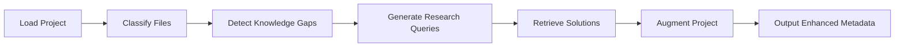

# AGI Project Compiler

**Enhance codebases with AI-driven knowledge augmentation**

## What It Does

This tool analyzes software projects to:
1. 🔍 Identify knowledge gaps in code files
2. 🧠 Automatically research solutions using web/local knowledge
3. 💡 Attach relevant insights directly to your codebase
4. 📦 Compile enhanced project metadata

## How It Works

### Core Pipeline


### Key Components
1. **Hardware-Aware Model Loading**  
   - Automatically selects optimal models based on available GPU/CPU
   - Supports 4-bit/8-bit quantization for large models

2. **Hybrid Knowledge Engine**  
   - Web search (SerpAPI) + Local knowledge base
   - Smart caching with TTL expiration
   - Rate limiting and circuit breakers

3. **Structured AI Processing**  
   - File classification (e.g., "API endpoint", "database operations")
   - JSON-enforced AI responses
   - Token-aware processing

4. **Production Features**  
   - Async I/O with concurrency control
   - Comprehensive error handling
   - Detailed analytics tracking

## What It's For

Use this compiler to:
- ✨ Enhance legacy codebases with modern knowledge
- 🚀 Kickstart new projects with AI-researched best practices
- 📚 Create self-documenting code repositories
- 🔍 Identify architectural gaps in complex systems
- 🤖 Build foundation for AGI-assisted development

---

## Setup
```bash
# Install dependencies
pip install torch transformers sentence-transformers aiohttp tqdm pydantic

# Configure environment
export SERPAPI_KEY="your_api_key"
mkdir -p sample_project output cache logs vector_db

# Run compiler
python compiler.py
```

## Configuration
Edit `CompilerConfig` in code to:
- Set project paths
- Adjust research depth
- Configure caching
- Manage resource limits

> **Note**: Web search requires [SerpAPI key](https://serpapi.com/)
